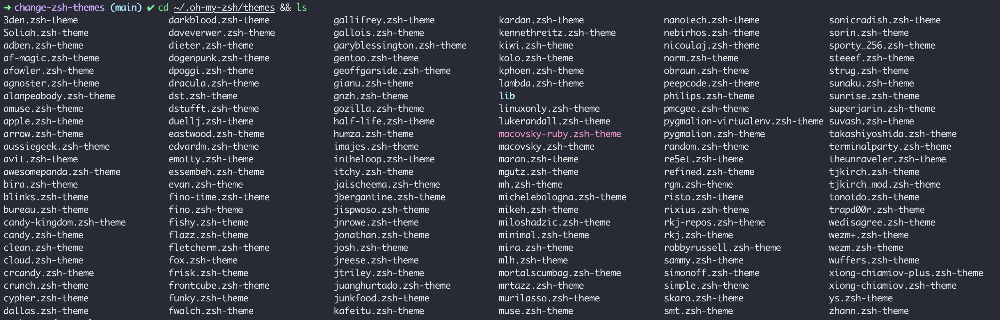
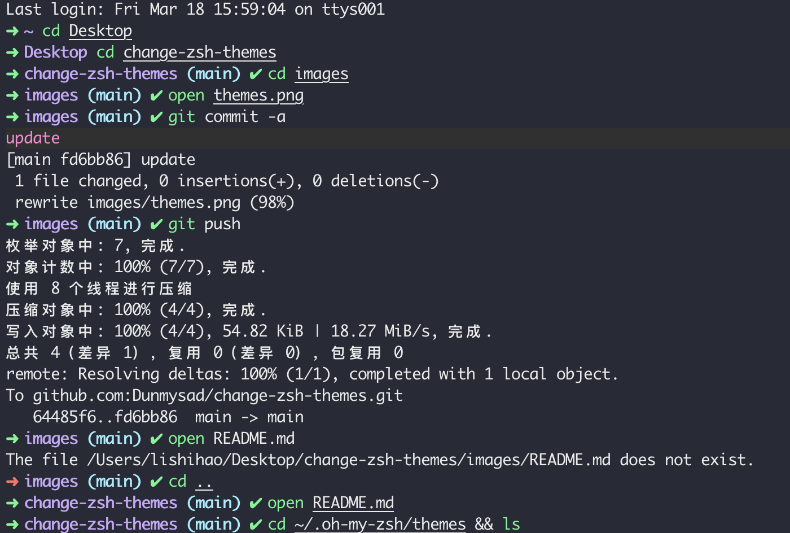

###	Centos 可能会出现的错误


切换镜像

```bash
# 进入yum.repos.d 目录下
cd /etc/yum.repos.d/
# 要将之前的mirror.centos.org 改成 vault.centos.org
sed -i 's|#baseurl=http://mirror.centos.org|baseurl=http://vault.centos.org|g' /etc/yum.repos.d/CentOS-*
```

##	下载zsh

```bash
yum install -y zsh
```


##	安装git

```bash
yum install git
```


##	安装oh-my-zsh

```bash
# curl
sh -c "$(curl -fsSL https://raw.githubusercontent.com/robbyrussell/oh-my-zsh/master/tools/install.sh)"

# or wget
sh -c "$(wget -qO- https://raw.githubusercontent.com/ohmyzsh/ohmyzsh/master/tools/install.sh)"

# or git
git clone https://github.com/robbyrussell/oh-my-zsh.git ~/.oh-my-zsh
```

设置zsh主题为默认

```bash
# 查看正在使用的主题
echo #SHELL

# 查看都有哪些主题
cat /etc/shells

# 设置zsh为默认
chsh -s /bin/zsh
```


##	查看oh-my-zsh自带的主题

```bash
cd ~/.oh-my-zsh/themes && ls
```


如果更换`oh-my-zsh`自带主题，可以修改`ZSH_THEME`字段值为以`.zsh-theme`后缀文件的文件名，例如`ZSH_THEME="cloud"`
##	下载更换 Dracula 主题

> ​		[Dracula->zsh](https://draculatheme.com/zsh)

```bash
git clone https://github.com/dracula/zsh.git
```

##	移动文件到zsh配置

```bash
cp zsh/dracula.zsh-theme ~/.oh-my-zsh/themes
cp -r zsh/lib/ ~/.oh-my-zsh/themes
```

##	更改zsh主题为dracula

```bash
vim ~/.zshrc

# 更改内容
ZSH_THEME="dracula"


# 更新配置
source ~/.zshrc
```


## 代码高亮

```bash
cd ~/.oh-my-zsh/custom/plugins/
git clone https://github.com/zsh-users/zsh-syntax-highlighting.git
vim ~/.zshrc

# 更改内容
plugins=(
	git
	zsh-syntax-highlighting
)

# 更新配置
source ~/.zshrc
```

##	命令补全

```bash
cd ~/.oh-my-zsh/custom/plugins/
git clone https://github.com/zsh-users/zsh-autosuggestions
vim ~/.zshrc

# 更改内容
plugins=(
	git
	zsh-syntax-highlighting
	zsh-autosuggestions
)

# 更新配置
source ~/.zshrc
```


#	最终效果



